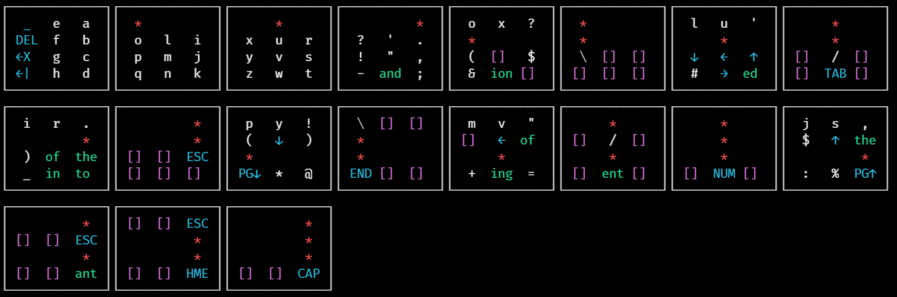
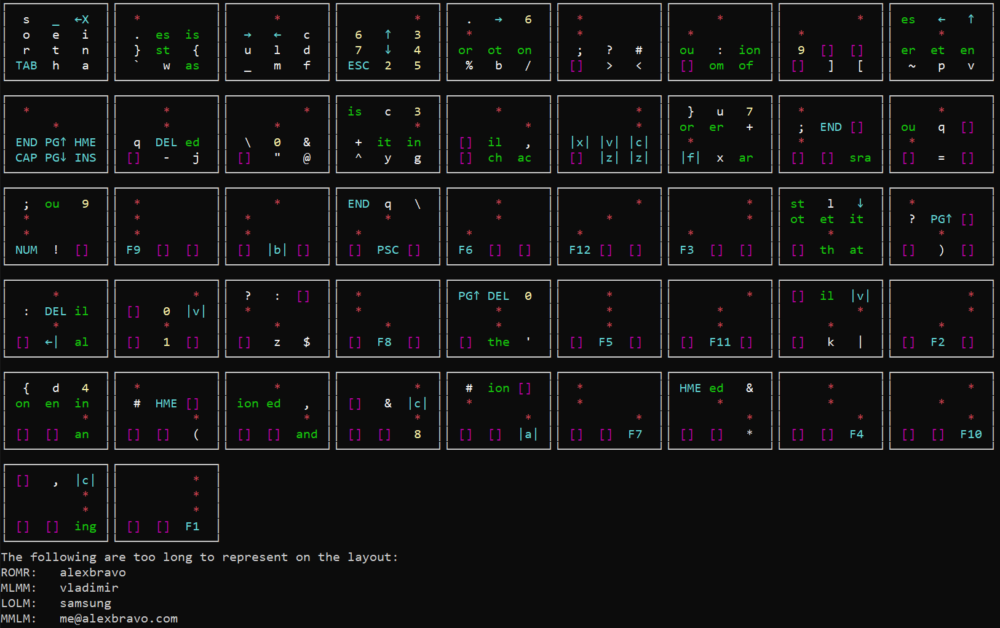
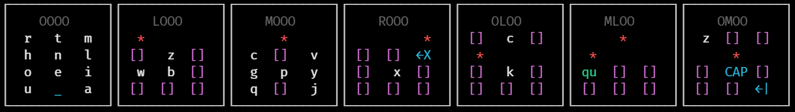
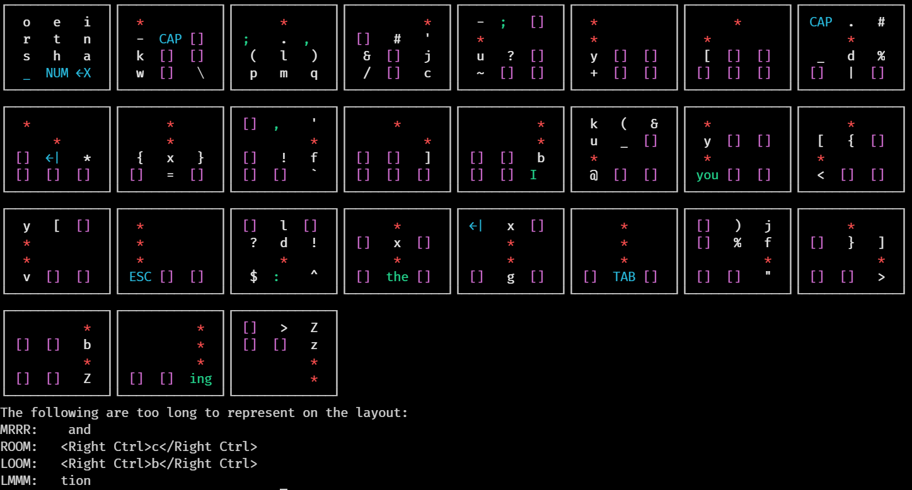
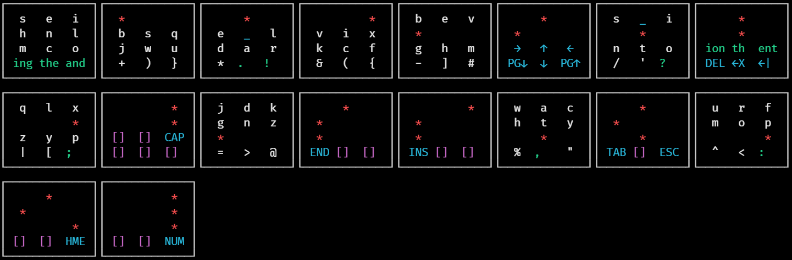
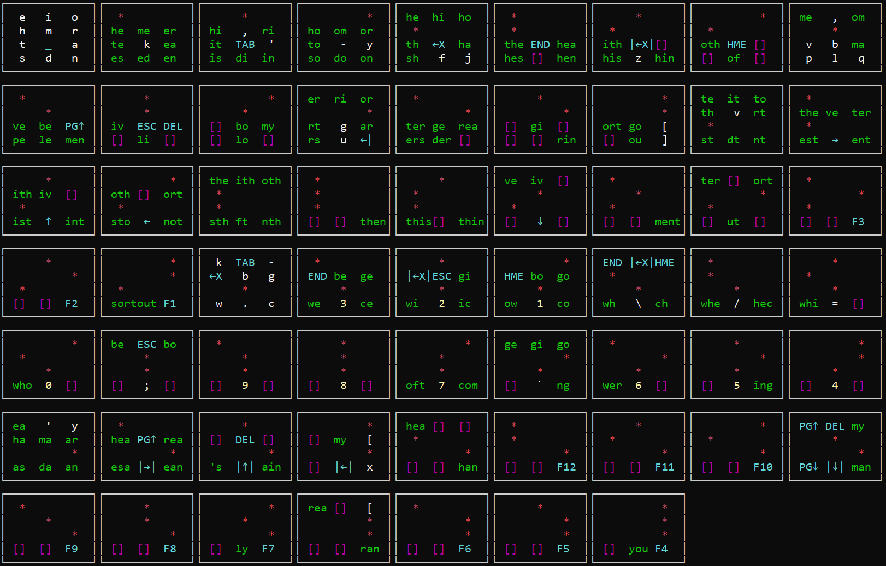
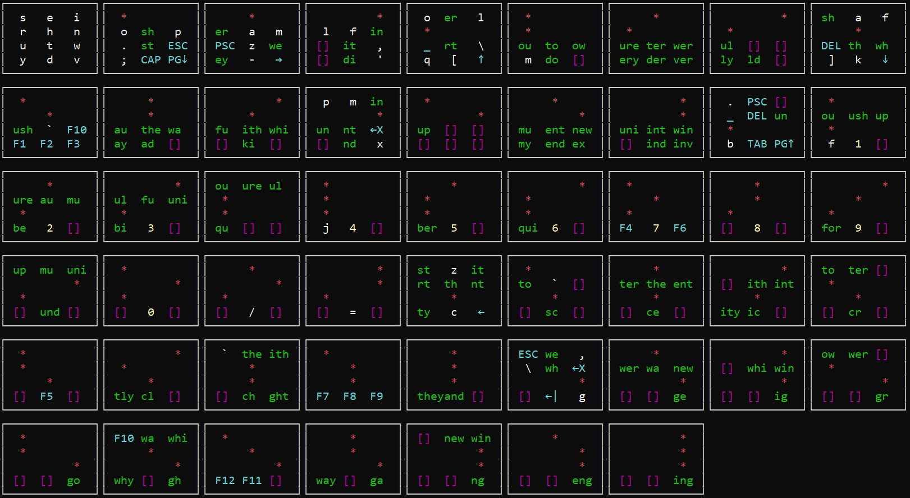

# twiddler-layout-printer

A PowerShell module to generate diagrams of Twiddler layouts.

## What is a Twiddler?

Have a look [at this repo](https://github.com/Geoff-Lillis/twiddler-oran-layout). It has some background on Twiddlers and the layout I typically use.

## Background and Design Goals

My current Twiddler layout was mostly designed by genetic algorithm: I wrote this layout printer to get a visual representation of the layout every thousand generations or so, to help me check progress. I wanted to be able to:

* Quickly see if high value letters and other keystrokes were moving to easy to press button combinations
* Easily distinguish different classes of keystrokes (letters, symbols, numbers and so on)
* Spot unused gaps which I could use for, say, navigation keys or numbers

## Limitations

* This module only displays chords where no modifier keys are used. For example if 'OOOR' gives you the letter 'A', but Ctrl + 'OOOR' gives you your e-mail address, you won't see the latter on the display.
* Chords that use multiple buttons in the same row are not supported. (At time of writing this is an [experimental feature](https://twiddler.tekgear.com/doc/doku.php?id=tuner_experimental) on Twiddlers.)
* Poor accessibility: will not work well with screen readers. This is lack of experience on my part. If you use a screen reader, have suggestions on how to represent layout information in an accessible format, and want something like this, do let me know. Happy to give it some time.

## Interpreting the Layout

### Colours used

| Colour | Meaning                               |
| ------ | ------------------------------------- |
| White  | Letter, punctuation, brace            |
| Blue   | Navigation, whitespace, function keys |
| Green  | Multi character output                |
| Yellow | Numbers                               |
| Purple | Unassigned chord                      |
| Red    | Indicates an activated key            |

### One button chords

The top left grid shows the result from pressing individual buttons and is the easiest to interpret. What you see is what you get.

### Representing activated keys

A red asterisk (*) indicates that the key or keys in question are being held down. The rest of the grid indicates what output will be produced if the key at that location is also pressed.

### Special keys

For reasons of space and readability some keystrokes are shortened or changed. Details below:
<!-- Todo: Add to this. Remove from Oran layout repo and add a link back. -->
| Symbol | Meaning                                         |
| ------ | ----------------------------------------------- |
| ←X     | Backspace                                       |
| \|←X\| | Ctrl + Backspace (Delete entire word)           |
| ↑      | Up arrow                                        |
| PG↑    | Page up                                         |
| →      | Right arrow                                     |
| ↓      | Down arrow                                      |
| PG↓    | Page down                                       |
| ←      | Left arrow                                      |
| \|↑\|  | Ctrl + up arrow                                 |
| \|→\|  | Ctrl + right arrow (Right one word)             |
| \|↓\|  | Ctrl + down arrow                               |
| \|←\|  | Ctrl + left arrow (Left one word)               |
| ←\|    | Enter                                           |
| PSC    | Print Screen                                    |
| DEL    | Delete                                          |
| ESC    | Escape                                          |
| HME    | Home                                            |
| END    | End                                             |
| TAB    | Tab                                             |
| CAP    | Caps Lock                                       |
| _      | Space bar                                       |
| \|c\|  | Ctrl + c                                        |
| \|x\|  | Ctrl + x                                        |
| \|v\|  | Ctrl + v                                        |
| \|z\|  | Ctrl + z                                        |
| \|a\|  | Ctrl + a                                        |
| \|b\|  | Ctrl + b                                        |
| \|f\|  | Ctrl + f                                        |
| <!->   | Markdown comment, then move the cursor left * 4 |

## Example Use

```powershell
$Layout = Get-LayoutFromCSV 'C:\temp\twiddler_cfg_oran.csv'
Format-Layout $Layout -ReduceDuplicates
```

## Example Layouts

### The Default Layout



### Backspice



### TypeMax



### GeekHand



### MirrorWalk



### Oran



### Left Hand Only Dvorak (ish)


